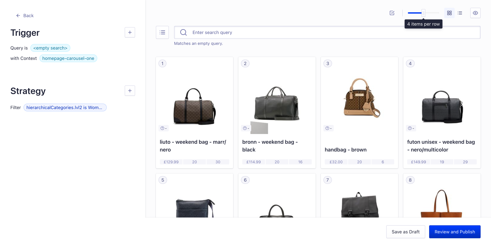

# Carousels

## What are Carousels?

Carousels are a way to display products in a horizontal scrollable list. They are a great way to highlight products that you want to promote to your users. They are also a great way to show products that are related to the product that the user is currently viewing.

## How do Carousels work in Algolia?

Think of a carousel as simply a mini search results page in a unique design i.e. a horizontal scroll.

Therefore, the results which are shown, are dictated by the API request sent to Algolia by that carousel.

You can create the results for the carousel by combining any Algolia features such as: query, filter, sort, merchandising, recommend (i.e. trending, frequently bought together, related products etc.)

Please note that carousels can also be fully personalised, just as the result of the Algolia results can be.

## How do I configure Carousels?

Carousels can either be hardcoded by the frontend of your application, or they can be configured using the Algolia dashboard.

For example, your frontend can send a request to Algolia with a query of `*` and a filter of `brand:Apple` and a sort of `price:asc` and a limit of `10` and instruct the results to be shown in a carousel.

Alternatively, you can set your frontend up to create a carousel for a rule context. This context can then be fully configured in the Algolia dashboard. For more info on rule contexts, please see [here](https://www.algolia.com/doc/guides/managing-results/rules/rules-overview/#using-context).

## Boilerplate implementation of Carousels

Carousels are configured using [rule contexts](https://www.algolia.com/doc/guides/managing-results/rules/rules-overview/#using-context). You can configure your carousels by going to `config/carouselConfig` and adjusting the values for each `context`. You must ensure you have a rule in the algolia dashboard for each context, which pins products as this is what powers the carousels.

Inside `featuresConfig.js`, allow the `shouldHaveCarousels` const to be `true`.
That should get the carousels showing on the homepage of the app.

After this, head to `carouselConfig.js`, where you can edit the context that is being sent to the API. This will help you to control and edit what is shown on these carousels.

To edit the title on the carousel, open `translation.js` where you can edit the _titleCarousels_ array to change the respective titles of your carousels.

You can then head to the Algolia Dashboard to edit the rule contexts that are being sent over. This is done using the visual editor, where the Query is empty and is triggered by a context.

Then you can edit the Strategy to apply whichever pins or boosts that you like.

## Learn more

### Algolia Resources

https://www.algolia.com/doc/guides/solutions/ecommerce/browse/product-carousels/static-product-carousels/

https://www.algolia.com/doc/guides/solutions/ecommerce/browse/product-carousels/dynamic-product-carousels/

https://resources.algolia.com/analytics/devvirtualevent-livecodingpersonalizedcarousels-marketplace

### External Resources

https://www.smashingmagazine.com/2022/04/designing-better-carousel-ux/

https://webflow.com/blog/carousel-slider-design-best-practices

https://mailchimp.com/en-gb/resources/carousel-slider-design-best-practices/
