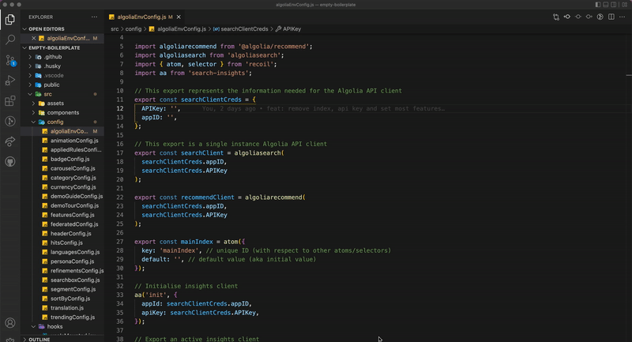
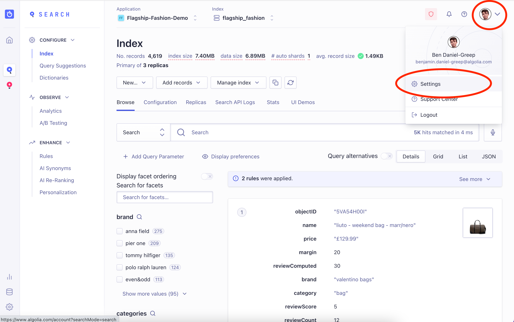
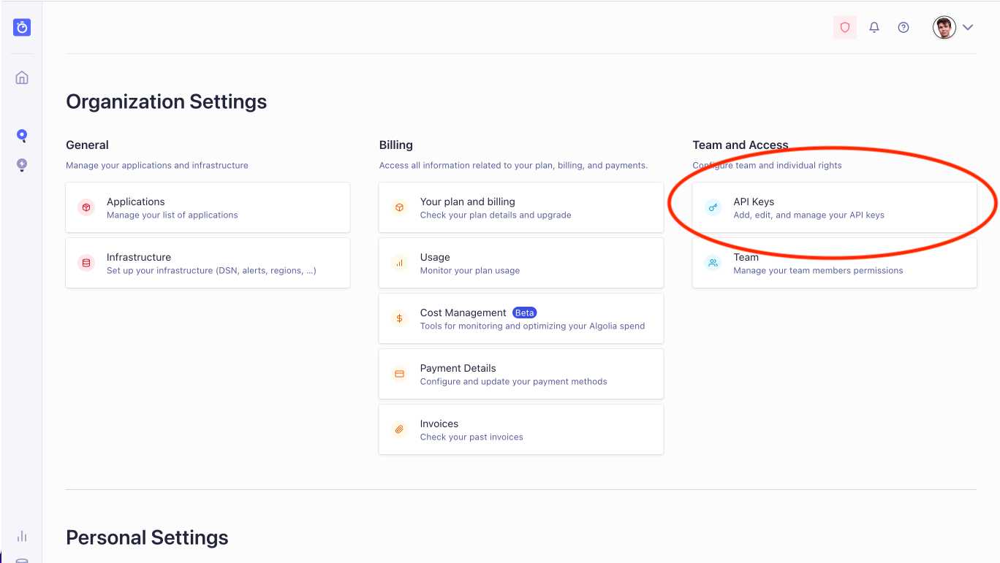

# ENV

After cloning the Boilerplate into your own IDE, open up `src > config > algoliaEnvConfig.js`

There are three items to add.

1. In _searchClientCreds_, add an API key in the value of _APIKey_ - this will typically be the Search API Key, it should never be an admin key.

   API keys can be found on the dashboard in:
   Settings > API Keys

2. In _searchClientCreds_, add your App ID in the value of _appID_. You can easily see your App ID in the URL when using the dashboard, or at the top of the dashboard itself.
   

3. In _mainIndex_, add the index name to the default value. You can find your index name at the top of the dashboard:

   The index name should represent the index which contains the main content for the demo, normally products.

When viewing the running boilerplate locally, you should then see at least some information appearing when you click on the search bar.

Your next step is to configure `hitsConfig.js` to show results correctly.
