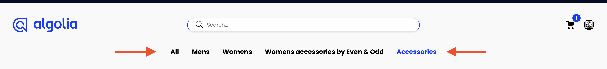
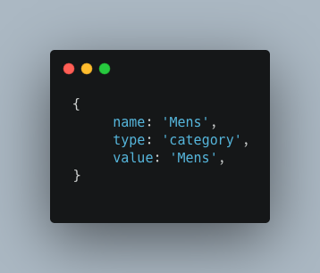
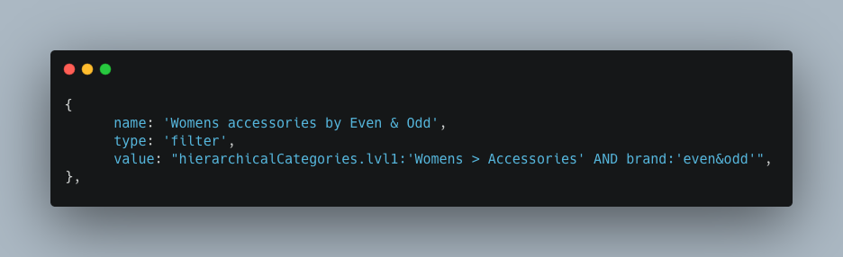
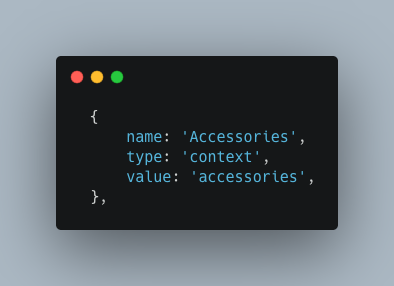

# Navigation

The file `Navigation.jsx` is the component file which renders your navigation headers.

They will be shown on all pages of the boilerplate, like so:

You can edit your navigation links in `src > config > navigationConfig.js`, within the `linksHeader` variable.

Each link must have a `name`, `type` and `value`.

The name can be anything you want, this is the text that will appear in the navigation bar.

The type must be one of three, and this dictates how the value is used in the search query:

## Category

This will attempt to filter using a virtual refinement list, combining the value with the `categoryPageFilterAttribute` const at the top of the file. It is best used for simple category pages, eg _Mens_, _Dresses_ etc. Further documentation [here](https://www.algolia.com/doc/api-reference/api-parameters/facetFilters/).

## Filter

This will add the value as a raw filter directly to the search query, it is best used for complex filters which cannot be created using the `category` type, i.e. `hierarchicalCategories.lvl1:'Womens > Accessories' AND brand:'even&odd'`. Further documentation [here](https://www.algolia.com/doc/api-reference/api-parameters/filters/).

## Context

This will add a [rule context](https://support.algolia.com/hc/en-us/articles/4406981936785-What-is-a-Rule-context) to the query, which will trigger any rule you have created in the Algolia dashboard for that rule context. This is best used for collection pages, but bear in mind they are not currently searchable. Further documentation [here](https://www.algolia.com/doc/guides/managing-results/rules/rules-overview/#rules-responding-to-user-context).

