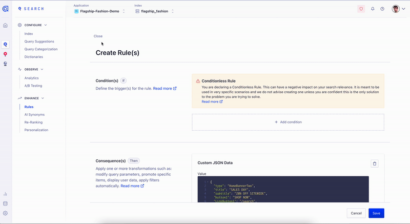

# Banners

Please read the official Algolia docs on Banners for more help:
https://www.algolia.com/doc/guides/managing-results/rules/merchandising-and-promoting/how-to/add-banners/

There are two types of banners in this Boilerplate - **Homepage banners** and **Search Result Page banners**.

## Configuring the banners

### Homepage Banner

To inject a banner on the homepage, you'll want to create a new Rule in the Algolia dashboard for your index. It'll be a Manual Rule that is applied without condition, and returns Custom JSON Data:



The Boilerplate is designed to receive Custom JSON from Algolia's API with `type: HomeBannerTwo`, eg:

```
{
  "type": "HomeBannerTwo",
  "title": "SALES DAY",
  "subtitle": "20% OFF SITEWIDE",
  "button1": "SHOP NOW",
  "LinkButton1": "/search",
  "imgUrl1Mobile": "https://res.cloudinary.com/hugo-valla/image/upload/v1663765137/BoilerPlate/mobile-home_grll2u.webp",
  "imgUrl1": "https://res.cloudinary.com/hugo-valla/image/upload/q_20/v1657721542/BoilerPlate/Group-1-_2__exxrnm_1_mjriib.webp"
}
```

You can change `HomeBannerTwo` to something else as long as you also change the reference to it in the BoilerPlate code in `src > components > banners > HomeBanners.jsx`

You can edit or duplicate this example, and personalise the different fields.

### Search Result Page Banner

- The Search Result Page banners use the same Custom JSON from the Algolia dashboard, but are generally set to a query or filter (eg 'shoes'). It'll contain:
  - type: set this to "bannerSrp"
  - title: title text
  - banner: this is an image url
  - link: if you want to link to a url
