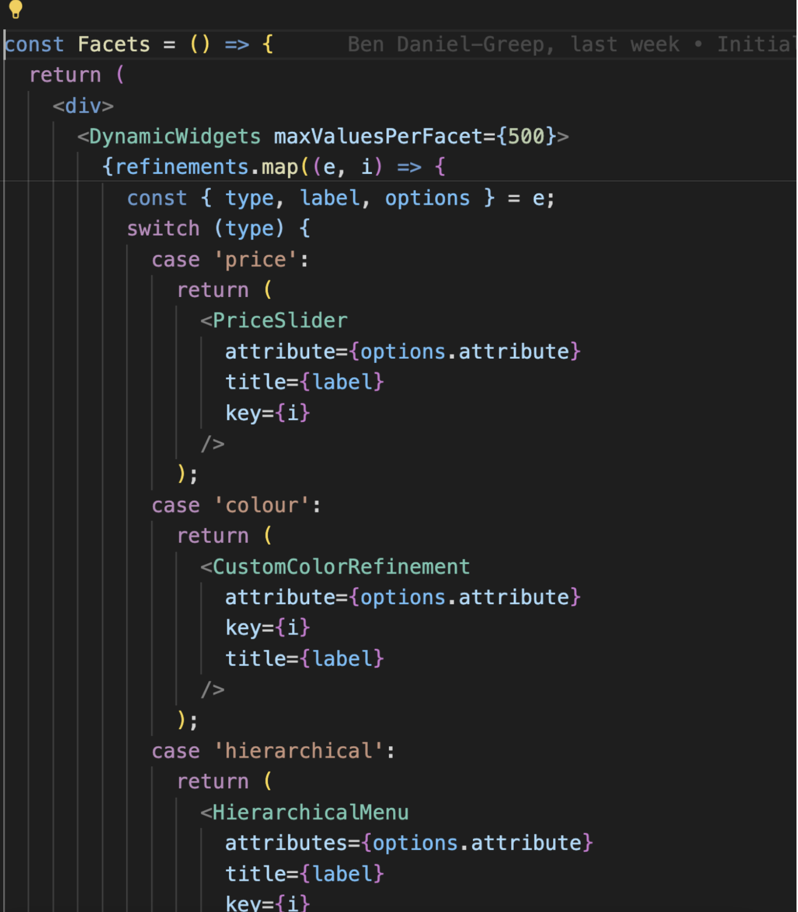
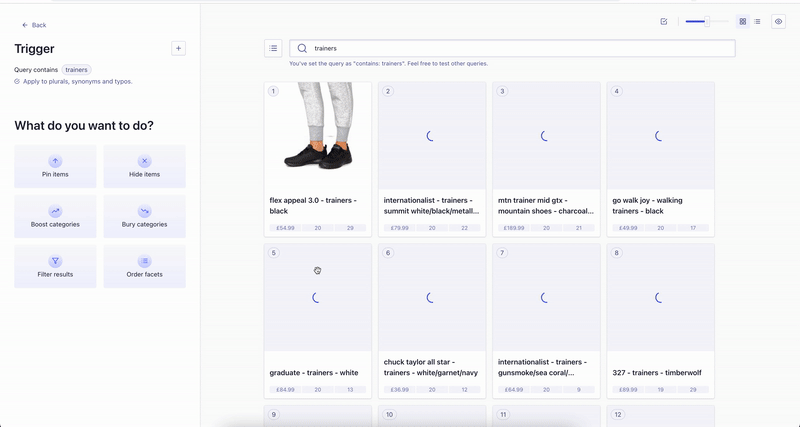

# Dynamic Facets

If you don’t know what dynamic facets are, and why we use them by default, it’s because this allows you to merchandise your facets. For more info, [look here](https://www.algolia.com/doc/guides/solutions/ecommerce/business-users/ongoing-optimizations/merchandise-facets/#configure-facet-ordering).

In your IDE, head over to `src > components > facets > Facets.jsx`

Here you’ll see that inside the Facets component that `<Dynamic Widgets>` is wrapping the other components inside. This is to allow InstantSearch to reorder the facets according to your input.

Now open up the Algolia dashboard for the Index, in your browser. You need to do two things in order for your facets to appear on the page.

- In the Facets section of Configuration, make sure the attributes you want shown have been added.

- In the Facet display section of Configuration, make sure you add all the facets again which you want to control the display of.

Now you’ve done this, you can use rules to show, hide, pin different facets on any page or search. Here is how you can do that:

In Rules, you will want to create a rule with the Visual Editor, in this case for when a query is entered (eg. ‘trainers’):

Then you can edit the consequence to order the facets as you’d like them to appear (eg. size first, then gender, colour, etc):

You should now see the facets change when you enter your search term:

