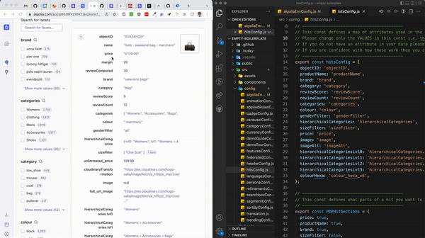

# Hits

Now that you have the application details correct, we can go ahead and correctly display the hits across the app.

Open `src > config > hitsConfig.js` in your IDE
Also open up the Algolia dashboard for the Index, in your browser.

You’ll want to match the attribute names in your index to the values of the hitsConfig file. This will allow the hits component to pull the correct data from the Algolia API.

Done!
