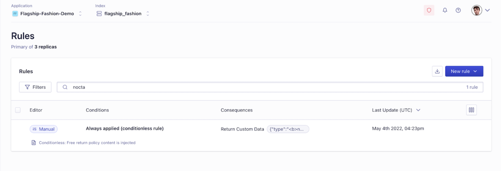
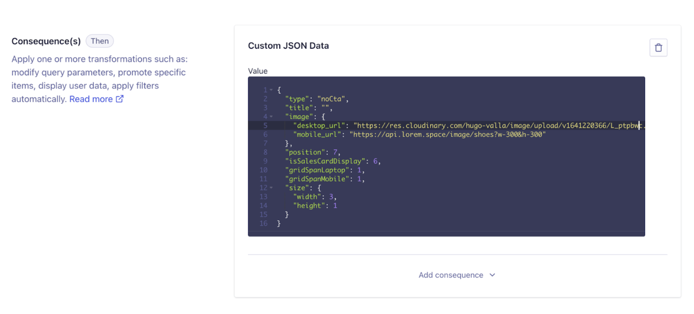
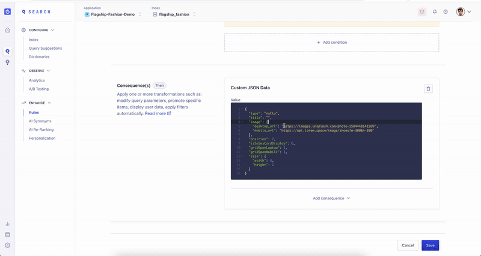
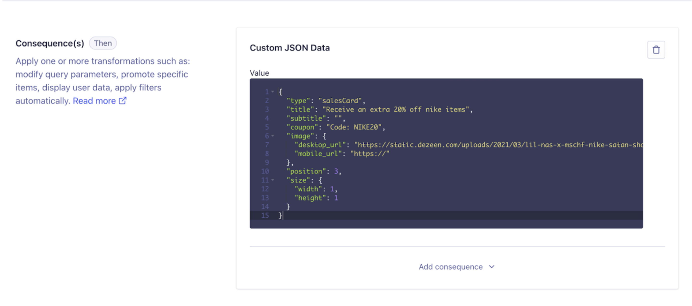

# Injected Content

Here is some documentation on Injected Content that might help you:
https://github.com/algolia/algolia-react-boilerplate#--injected-content

https://www.algolia.com/doc/guides/building-search-ui/ui-and-ux-patterns/injecting-content/react/

### From Main Index

This is for changing the cards (or 'injected content') that you see on the Search Results Page, like this Nike card:


`NoCtaCard.jsx`
Component to build the hit for simple injected hit cards, eg Free Returns

To edit the _NoCtaCard_, head over to the dashboard and head to the Rules section of your main index.
Search for noCta and you’ll see the rule:



Here you can edit the JSON. Changing the image urls and the position is all you should need to do in this case. `‘position’` is where the card will be placed in the hits list.



Here’s an example of how quickly you can change the card, just by altering the image url:



You can also edit the component by opening:
`src > components > hits > components > injected-hits > NoCta.jsx`

`SalesCard.jsx `
Component to build the hit for items on sale

It’s very similar to the NoCtaCard, with the addition of some text in the JSON:



### From Separate Index

`InfluencerCard.jsx`

This component is called when another index has been created to inject content. In `SrpLaptop.jsx` you can see that we're using the Index IS widget to call a new index. IS will therefore look into that index and send a response according to the query a user is typing.

This is a different way to inject content than the rules.

For this we define a new index in `algoliaEnvConfig.js` called `injectedContentIndex` and if there is a result in this index, we inject it as a result into the Hits.

Here is a sample record structure which is expected for records in the index to inject:

```
{
"name": "Curry Stephen Under Armour",
"gender": "Man",
"influencer": {
"name": "Stephen Curry",
"slug": "steph_curry",
"image": "https://about.underarmour.com/sites/default/files/styles/1600xauto/public/2020-11/SC_Curry%20Brand%20FW20%20%284%29.jpg?itok=Rx555Up8"
},
"category": "Shoes",
"sku": "M0E20000000EL70",
"objectID": "fab81fae69624_dashboard_generated_id"
}
```

### Other components

`injectContent.js`
This component is what takes the injected content and injects it into the array of hits at the specified indexes.You shouldn’t need to edit it.

`InjectedHits.jsx`
This component takes the hits, injects the new cards within the hits, and returns a CustomHits component with the new updated hits. You shouldn’t need to edit it.
