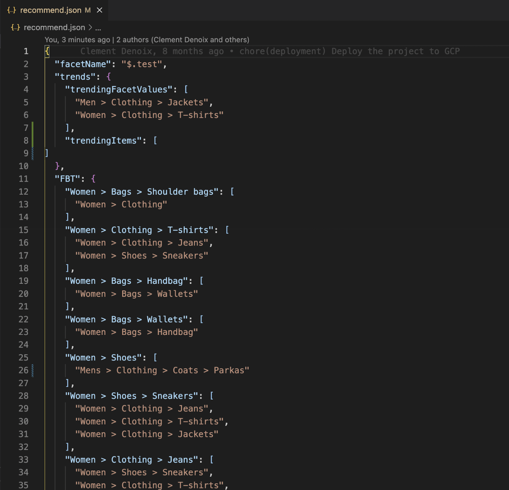
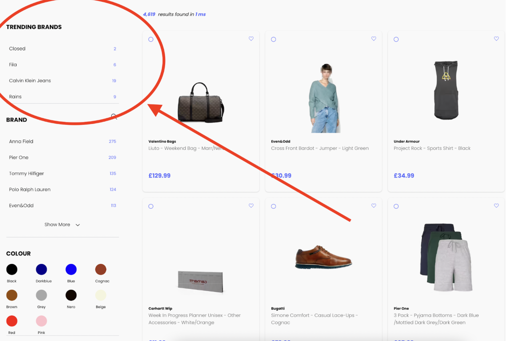

# Recommend

For **Frequently Bought Together**, **Related Items**, **Trending Items** & **Trending Facet Values**

Read about Recommend here:
[Recommend](https://www.algolia.com/products/recommendations/)

In order to generate (fake) the data for a Demo, we use a tool called **FIG**.

Use FIG to generate the CSVs needed for Recommend, which you can then upload to the dashboard, and following this, enable FBT and Related in the appropriate config of this application.

We wrote a Gdoc to detail how use [FIG](https://github.com/algolia/fake-insights-generator). You can find it [here](https://docs.google.com/document/d/1T8ClZX5I06D-NpV9ZehFCXA_yx095cCFd7P2e3VeM5U/edit?usp=sharing).

Recommend is present in this app on the homepage, search results page, product details page, and also on the NoResultsPage.

Homepage: Trending products
Results Page: Trending products and trending facet values
PDP: Related and FBT
NRP: Related

## Using FIG

You will want to use this documentation:

[FIG docs](https://algolia.atlassian.net/wiki/spaces/PK/pages/4168515639/Fake+Insights+Generator+-+FIG)

The first step is installing FIG locally.
**NB** You might also need to install GO locally. To do this, run `$ brew install go` in your terminal.

We will be using the `fig recommend` command to generate some CSV files. These files will then be uploaded to the Algolia Recommend Dashboard where the AI will process them. Head over to the [recommend section](https://algolia.atlassian.net/wiki/spaces/PK/pages/4168515639/Fake+Insights+Generator+-+FIG#fig-recommend) of the page.

In order to do this you’ll want to open up the FIG file in your IDE and open `recommend.json` where you will configure the output of the recommend generator.

We have the sections `trendingFacetValues`, `trendingItems` and `FBT` (frequently bought together).
There is `facetName` which is the attribute on which you are training the model.
You can edit the objects to train the model with items and their related purchases.

Trending facet values are the facets that will appear in the Trending Facets Component on the Boilerplate. In this example the component is named ‘Trending Brands’ in `src > config > translations.js`

