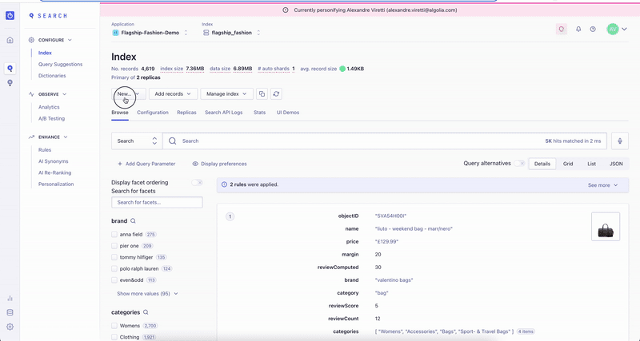
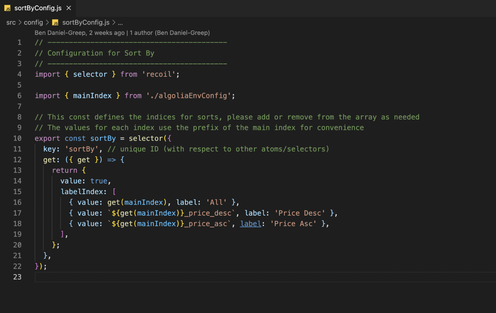
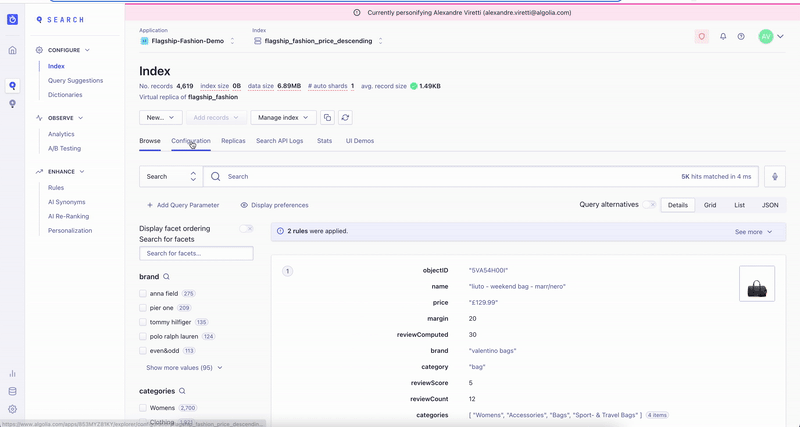
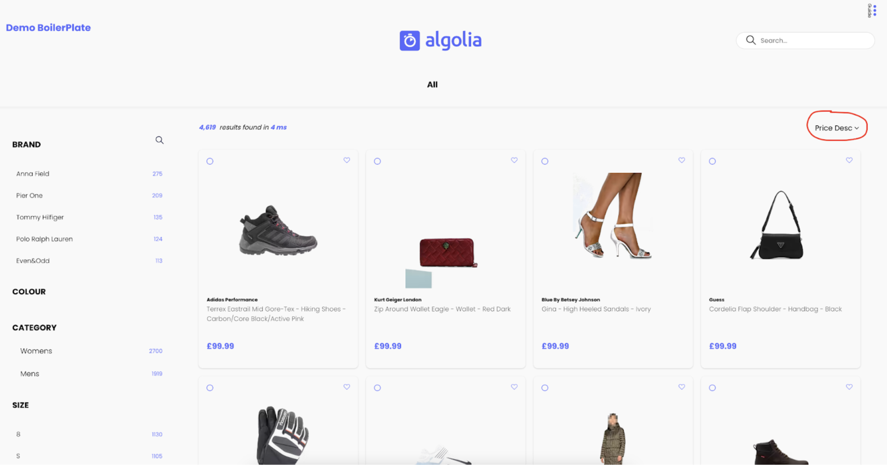

# Configuring Sort By

Open the dashboard in your browser and make sure you’re in the main index of your application.

Sort bys use Replica Indexes to reorder the results. You will want to create a new Virtual Replica and name it with a suffix according to its function.

If you’re wondering about the difference between standard and virtual replicas, virtual replicas are capable or relevant sorting, whereas standard are not. More info here.

The Boilerplate is built to take \_price_desc or \_price_asc as a suffix. You can see this below, in `src > config > sortByConfig.js`

**\*NB** this example names the replica differently because the `flagship_fashion_price_desc` index already exists\*

You can edit the values of the sortBy selectors if you want to name the index differently. Just make sure it matches the index name on the dashboard!

After creating your Replica Index, navigate into it and open the Configuration tab and open Relevant Sort. This is where you can edit the ranking of your sort attributes. In this case we want to sort by price descending, so we’re putting a price attribute at the top of the list.

The frontend code already exists in the Boilerplate. In `src > config > featuresConfig.js` check that `shouldhaveSorts` is true

You should now see the sort by widget on the search results page:

