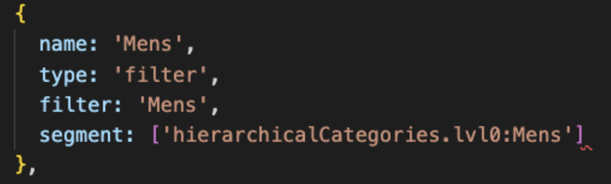
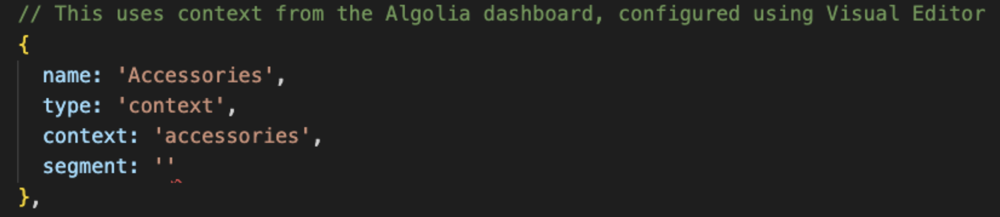

# Navigation

The file `Navigation.jsx` is the component file which renders your navigation headers.
You can edit your navigation links in `src > config > navigationConfig.js`
There are different types of navigation links that you can have, but the component is clever and can handle different types of links.

### Category Pages

These are pages that exist as categories in the index, eg _Mens_ from `hierarchicalCategories[lvl0]`
This is set from the const _categoryPageFilterAttribute_ at the top of the file.

### Collection Pages

These are made by pairing a **navigation link** to a **rule context** in the Algolia Dashboard
Start by creating or editing a new navigation object with `type: ‘context’`
(NB these collection pages are not currently searchable)

Then in the Algolia dashboard for your main index, create a new rule that applies to an empty query condition with **context**. Then simply make it filter results on the attribute you’ve chosen.

<!--  -->
