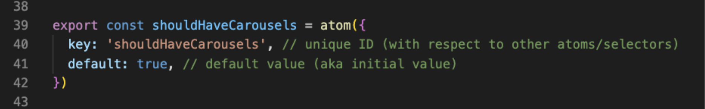
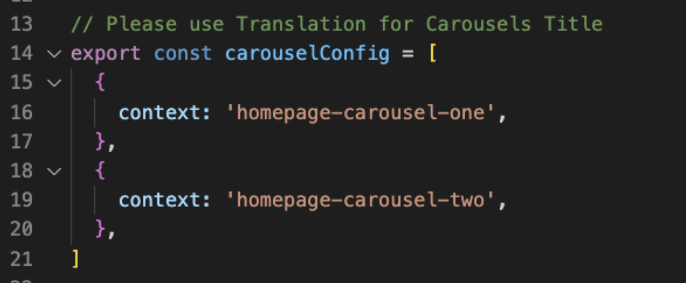

# Carousels

Carousels are configured using [rule contexts](https://www.algolia.com/doc/guides/managing-results/rules/rules-overview/#using-context). You can configure your carousels by going to `config/carouselConfig` and adjusting the values for each `context`. You must ensure you have a rule in the algolia dashboard for each context, which pins products as this is what powers the carousels.

You can find an example carousel rule by searching for `qr-1651497727816` in `rules/example-rules.json`.

Inside `featuresConfig.js`, allow the `shouldHaveCarousels` const to be `true`.
That should get the carousels showing on the homepage of the app.

After this, head to `carouselConfig.js`, where you can edit the context that is being sent to the API. This will help you to control and edit what is shown on these carousels.

To edit the title on the carousel, open `translation.js` where you can edit the _titleCarousels_ array to change the respective titles of your carousels.

You can then head to the Algolia Dashboard to edit the rule contexts that are being sent over. This is done using the visual editor, where the Query is empty and is triggered by a context.
Then you can edit the Strategy to apply whichever pins or boosts that you like.
