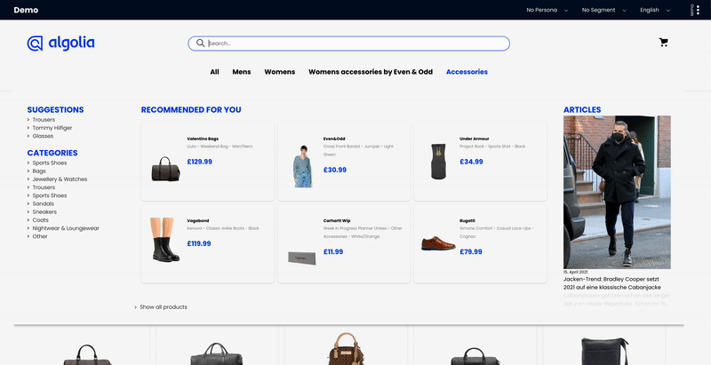
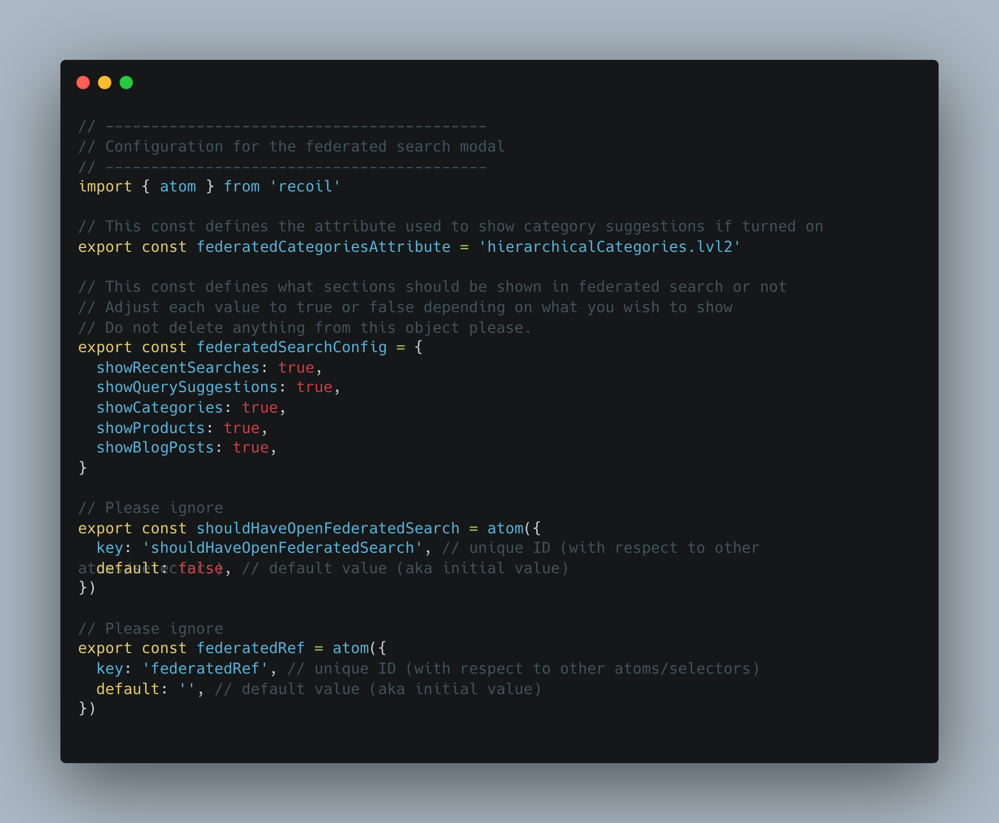
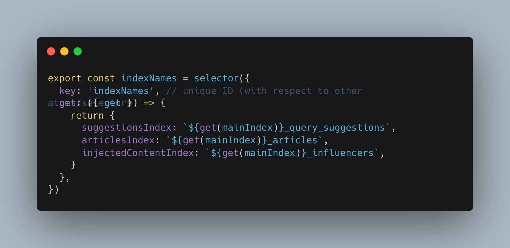

# Federated Search

### What is Federated Search?

Federated search is a technique used to search multiple data sources at once. With federated search, you can retrieve information from many different content locations with just one query and one search interface. In the case of the Boilerplate it searches Products, Articles(blog posts), Categories, Query Suggestions and Recent Searches- all done as-you-type.

You can turn on federated search in `config/featuresConfig` by setting the `default` value of `shouldHaveFederatedSearch` to true. You can then define which sections are shown by going to `config/federatedConfig`.

The Articles and Query Suggestions use different indexes, which can be controlled from `algoliaEnvConfig`, in `indexNames`:

